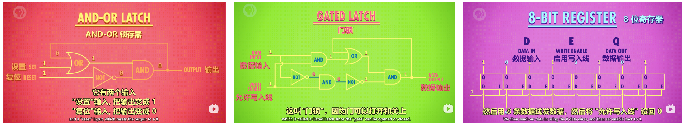

refs: 
- [【计算机科学速成课】[40集全/精校] - Crash Course Computer Science](https://www.bilibili.com/video/BV1EW411u7th?p=1)
- [课程字幕](https://github.com/1c7/Crash-Course-Computer-Science-Chinese/blob/master/(%E5%AD%97%E5%B9%95)%E5%85%A840%E9%9B%86%E4%B8%AD%E8%8B%B1%E5%AD%97%E5%B9%95%E6%96%87%E6%9C%AC.txt)

# Hardware Evolution
## Early Computing Tools [P1]

### Manual Calculation
2500 BCE, **abacus**, Mesopotamia [0230]

1613 ~ 1800s, human computer & **pre-computed tables** [0430]
- earliest word "computer": job title
- militaries **Range Tables**: the angle to set the canon [0640]
  > canon/shel's design changed → whole table recomputed: time consuming & led to errors → 1822 Charles Babbage

### Mechanical
1694, **Leibniz**, Step Reckoner 步进计算器, decimal [0458]
> "it is beneath the dignity of excellent men to waste their time in calculation"
> 1st machine cap with **+ - × ÷**, used for the next 3 centuries
> ---
> **slow**: could take hours/days to solve real world problems
> **expensive**: hand-crafted 手工制作
> ---
> → turn to human **pre-computed tables** [0620]

**Charles Babbage**: father of computing
- 1822, Difference Engine 差分机 (could approx polynomials) [0732]
- during construction of the Difference Engine, Analytical Engine 分析机 [0815]
  > **general purpose computer**: given data and run ops in sequence; had memory and even a primitive printer

## Electronic Computing (History of Main Component) [P2]

### Relay
relays 继电器 [0135]  --- 1944, IBM, Harvard Mark I (one of the largest electro-mechanical computers) [0105]
> **slow switching speed**: mechanical arm has mass → can't move instantly (50 times/s in the 1940's)
> **wear and tear** 齿轮磨损: Anything mechanical that moves will wear over time
> - number of relays ↑, probability of failure ↑
> - replace, on average, one faulty relay every day, big problem in the running important, multi-day calculation
> - These huge, dark, and warm machines attracted insects --- bug

### Thermionic valve (diode → triode)
**thermionic valve** 热电子管, **1904,** electrical component [0345]
- two electrodes电极 inside an airtight glass bulb 气密玻璃灯泡 --- first **vacuum tube**真空管
- **thermionic emission**: electrode heated, electrons emit, electrode2 attracts --- flow of electric faucet
	- only if electrode2 positively charged (negative or neutral charge, electrons not attracted across the vacuum)
  - **diode** 二极管: electronic component that permits the one-way flow of current [0415]
  - needed a switch to turn flow on | off

**triode** vacuum tubes 三级管: 1906 [0425]
> 1906, American inventor Lee de Forest, added a 3rd "control" electrode (btw the two electrodes) in Fleming's design
- positive charge to control electrode → permit the flow of electrons as before

> no moving parts --- less wear, switch thousands of times per second, become the basis of radio, long distance telephone

> fragile, and can burn out like light bulbs
>
> initially expensive, a computer might require hundreds or thousands of electrical switches
>
> by the 1940s, cost and reliability improved, electro-mechanical computing → electronic computing

1943 12, Colossus MK 1, 1st large-scale use of **vacuum tubes** for computing [0540]
> 1st version of Colossus contained 1,600 vacuum tubes
> 
> regarded as the **1st programmable, electronic computer**
> - Programming by plugging hundreds of wires into plugboards --- [P10 ], sort of like old school telephone switchboards
> - while "programmable", it still had to be configured to perform a specific computation

1st truly **general purpose**, programmable, electronic computer: 1946, ENIAC [0635]
> 5000 ten-digit additions or subtractions per second, many, many times faster than any machine that came before it
> operational for ten years, estimated to have done more arithmetic than the entire human race up to that point

> with that many vacuum tubes failures were common
> ENIAC generally only op for about half a day at a time bf breaking down

1950s, vacuum-tube-based computing reaching its limits

### Transistor
**transistor** 晶体管: 1947, Bell Lab [0736]
- 2 electrodes sep by **semiconductor**半导体 (a material that sometimes can conduct electricity)
- the control wire attaches to a "gate" electrode
- changing the electrical charge of the gate → manipulated the conductivity of the semiconducting material

> **faster**: switch 10,000 times/s, today millions/s
> **smaller**:could be made smaller than the smallest possible relays or vacuum tubes, today < 50nm in size
> **running longer**: transistors were solid, unlike vacuum tubes made of glass and with carefully suspended, fragile components, today can run for decades

>**1st fully transistor-powered**: 1957, IBM 608 (smaller and cheaper computers)
>most common material of semiconductors: silicon → Silicon Valley; Shockley Semiconductor...employees later founded **Intel** [0930]

# Binary
**electro-mechanical devices**: repre decimal numbers by teeth on a gear; 
​**electronic computers** with transistors: turn the flow of electricity on | off [P3 0025]

## Why Binary [P3]
**Binary**: 2 states [P3 0040]
- possible to use transistors to allow for diff levels of current [0115]
  > Some early electronic computers **ternary**, even **quinary** (5 states)
  > more intermediate states → harder to keep them all sep (nearby signals can get mixed up)
  > gets worse with transistors changing states millions of times per second
  > just 'on | off' → most distinct signal to min these issues
- Another reason computers use binary: entire branch of math already existed that dealt exclusively with T/F --- Boolean Algebra 布尔代数 [0150]
  >  George Boole, self-taught English mathematician in the 1800s

## Bool Logic & Logic gates [P3]
3 fundamental ops: NOT | AND | OR [0243]

easily build boolean logic out of transistors [0305]: NOT/AND/OR/XOR gate [0400, 0525, 0610, 0715] 
  
>  call them **gates**: they ctrl the path of current [0443]

## Binary Representation [P4]
how represent info beyond T/F --- math: T/F states → 1 | 0 [P4 0015]
- represent larger things: add more binary digits to the front (same as decimal)

### Bit & Byte
a "**bit**": each binary digits, 1 or 0 [0315]
8-bit computers, 8-bit graphics or audio...8-bits such common in computing → special word: **byte**
> - Kilobytes **KB**, Megebytes **MB**, Gigabytes **GB**, Terabytes **TB**
> - 32-/64-bit computers, op in chunks of 32 or 64 bits [ P4 0430]
> - computers today use **32-bit color graphics** --- Instagram photos

### Numerical Repre
1st bit for **sign**: 1 for negative, 0 for positive, remaining for the number itself [0456]

**"floating point" numbers** [0550]
- IEEE 754 standard repre: scientific notation, significand有效数字 & exponent指数
- 32-bit repre... [0630]

### Text & File Repre
**text repre**: number the letters of the alphabet [0645]

**ASCII**: 1963, 7-bit code for 128 values, allowed diff computers built by diff companies to exchange data [0720]
> only designed for English
> a byte has 8 bits --- popular to use 8th bit for codes 128 ~ 255 previously unused, for "national" char
> - national char codes worked pretty well for most countries
> - broke with the rise of computing in Asia (Chinese and Japanese have thousands of chars) --- multi-byte encoding schemes, but mutually incompatible

**Unicode**: universal encoding scheme [0915]
> most common version of Unicode: 16-bit
> encoding letters: same as ASCII by binary numbers
> other file formats - like MP3s or GIFs, use binary numbers to encode sounds or colors of a pixel in our photos, movies, and music --- long sequences of bits

## Binary Storage [P6]
computers must label locations in their memory (aka **addresses**), in order to store/retrieve values [P4 0538]

### Storing 1-bit info: AND-OR latch & Gated Latch
AND-OR latch 锁存器: AND for storing bit `0`, OR for `1` [0120]
- (1, 0) => 1, (x, 1) => 0, (0, 0) => whatever is last put in
- 2 input ==> 1 input  **Gated Latch 门锁** [0315]

### Storing 8-bit info: 8-bit register
**register**: group of latches
put 8 latches side-by-side → (8 bit) register 寄存器 [0435]
> early 8-bit register → 16-bit, 32bit → today 64-bit

### 256-bit memory
> Putting latches **side-by-side** works ok for a **small-ish number of bits**
> while 64-bit register: 64 (input wire) + 64 (output wire) + 1 (write-enable wire) = 129 wires; 256-bit → 513 wires

256-bit memory: 16×16 latch matrix [0520]
- only `1` single **latch** **write-enabled** at any given time → allow a **single, shared**, write-enable && date-in wire
> **wire saving**: 16 rows/columns for the latch selection, 1 data-in wire, 1 write-/read-enable wire = 35 wires
- write data in on a particular latch (read data same)
	- Step 1: turn on the corresponding **row AND column** wire (activate this latch)
		- 16 rows && cols → **8-bit latch addr** (4-bit each for row/col) [0700]
		- require 2 multiplexer 多路复用器 (a compoent to convert latch addr into something that selects the right row or column), each for row/col selection [0700]
	- Step 2: turn on the (single, shared) **write-enable** wire
	- Step 3: put data in the (single, shared) **data** wire

### RAM
8 256-bit memory in a row → 256 addrs, each hold an 8-bit value [0837]
- given a 8-bit (latch) addr, each 256-bit memory component store 1 bit info (out of the total 8-bit info)

> modern computers scale to MB / GB of memory [0930]
> - **GB** (a billion bytes, 2^30) of memory: 32-bit addresses** (2^16×2^16 matrix)

an important property of this memory: we can access any memory location, at any time, and in a random order → it's called Random-Access Memory, or `RAM` [0955]

- stores things only when power stays on ---> persistent memory: survive without power [0040]

> an actual stick of RAM, a 1 MB RAM module from the 1980's: 128×64 bits × 4 × 32 × 8 = 8M bits = 1 MB [1015]

## Binary Loading
how data/program instructions read & stored in computer RAM

programs (a series of individual instructions: "instruct"指示 the computer what to do) [P7 0040]

### Early Programming [P10]
how program load into memory? [0025]

#### Early Textile Manufacturing
early machine programming need (bf the dev of computers) in textile 纺织 manufacturing, for pattern fabric 图案纺织品 [0050]
> to weave a big red tablecloth, simply feed red thread into a loom and let it run
> wanted the cloth to have a pattern like stripes/plaid 条纹/方格? 
> - workers would have to periodically reconfigure the loom as dictated by the pattern
> - labor intensive which made patterned fabrics expensive

#### Punch Card for Data
**1801**, programable textile loom 纺织机, store pattern for each row of cloth in a punched card 打孔卡片

**punch cards** (cheap, reliable, fairly human-readable) used to tabulate the 1890 US census

  - census worker punch out a hole at appropriate position on each card, to store individual's data
  - when a card fed into the tabulating machine, a hole would cause the running total for that specific answer +1

> - tabulating machine 制表机, roughly 10x faster than manual tabulations [P1 0919]
> - [1050] Hollerith founded The Tabulating Machine Company...merged with other machine makers in 1924 -> **International Business Machines Corporation** or IBM [P1 0919]

#### Physical Plug Board of Wires for Program
early tabulating machines not truly computers: op fixed (only tabulate, not programmable), punched cards stored data, not a program [0215]
- next 60 years, these business machines grew in capability
- programmer trigger diff funcs through **control panel 控制面板** (aka **plug boards**): plug cables (to pass values & signals bt diff parts of the machine) into little sockets 插孔 [图n]
  > rewire the machine for a diff program

1920s, plug boards swappable 可插拔, allow for diff programs (for diff funcs) be plugged into a machine [0255]
> plug boards complicated to program (wires tangle 缠绕) --- IBM 402 account machine, popular in 1940s [图]
> the ENIAC , completed in 1946, with many of plug boards, take time to wiring up
> - af a program had been completely figured out on paper, Physically wiring up the ENIAC and getting the program to run could take 3 weeks
> ​enormous cost of these early computers, weeks of downtime simply to switch programs was unacceptable

---

#### Storing in Computer memory
- late 1940~50s, electronic memory costs fell, size grew, possible to store program in computer memory, easily changed by programmers and quickly accessed by the CPU [0352]
  - these machines were called Stored-program Computers
- Von Neumann Architecture (Unifying the program and data into a single shared memory): With enough computer memory, could store program & data program need [0415]
  - hallmarks of a Von Neumann computer: a processing unit contains: an ALU + data registers + instruction register + instruction address register + a memory to store both data and instructions
    > first Von Neumann Architecture Stored-program computer: 1948, niversity of Manchester, nicknamed **Baby**
    > same arch used until now

#### load program and data into the computer by punch cards
- load program (hundreds of instructions) and data into the computer by **(stacks of) punch cards** [0510]
  > into the 1980s almost all computers have a punch card reader: suck in a single punch card at a time & write content into mem
  > largest program ever punched into punch cards: 1955, US Air Force's SAGE air defense system, 62,500 punch cards ~ 5 MB
  - once the program and data were in memory, the computer would be told to execute it
  - At the end of a program results could be written out of computer memory and onto punch cards by punching cards
- punched paper tape 打孔纸带 [图] [0635]

#### Panel programming
- another common way to program: Panel programming [图] [0655]
  - Rather than having to physically plug in cables to activate certain functions, done with huge panels full of switches and buttons
  - indicator lights to display the status of various functions and values in memory
    > Computers of the 50s and 60s often featured huge control consoles that look like this [图]
    > early home computers made for the hobbyist market use switches extensively, most home users couldn't afford expensive peripherals like punch card readers
    > The first commercially successful **home computer** was the Altair 8800, 1975 [图]
    > - To program the 8800: 
    >   1. toggle the switches on the front panel to enter the binary op-codes for the instruction
    >   2. press the deposit button to write that value into memory
    >   3. in the next location in memory, toggle the switches again, for your next instruction deposit it and so on
    >   4. When entered whole program into memory, oggle the switches moves back to memory address 0, ress the run button and watch the little lights blink

- Whether it was plug board, switches or punched paper, Programming these early computers was the realm of experts: needs knowledge of the underlying hardware, so things like processor op-codes and register wits, to write programs --- programming was hard and tedious, need a a simpler way to write programs --- programming language [0816]

### Programming Language [P11]

## Binary Calculation [P5]
Representing and storing numbers is important for a computer, but the real goal is computation: manipulate numbers in a structured and purposeful way --- **Arithmetic and Logic Unit (ALU)** [0015]

### Arithmetic unit & Adder
**arithmetic unit**: numerical ops [0130]

addition circuit [0145]
- **half adder** (single-bit): bit A, B ==> bit sum, carry [0210]
- **Full Adder** (multi-bit): bit A, B, C (carry) ==> bit sum, carry [0345]

**8-bit (ripple carry) adder** 行波进位加法器 [0440]
- **overflow**: exist a carry in 9th bit --- sum too large to fit in 8-bit [0530]
  - avoid overflow: more adder → 16 or 32 bits (more gates, take time for carries to ripple forward) [0605]

> modern computers use diff adding circuit: 'carry-look ahead' adder [0635]

8 general ALU ops... (how substraction implemented???) [0640]
- no × ÷ --- simple ALUs do `×` by `+`s

### Logic unit
[0735] **logic unit**: logical ops & simple numeric test (e.g. negative test), 0-testing circuit (for equality) [0750, 0945]

### 8-bit ALU
[0850] 8-bit ALU with 3 flags
> [0045, 0815] Intel 74181, 1970: 4-bit ALU, 70 gates, cann't multiply & devide...

# CPU & Programs Execution
## CPU [P7]

[0020] 2 types of computer memory
- Registers -- small, linear chunks of memory, store 1 byte
- RAM --- a larger bank of memory that can store many numbers located at diff addr
[0040] CPU: Central Processing Unit, to execute programs (a series of individual instructions: "instruct"指示 the computer what to do)
[0125] (cpu) microarchitecture
- [0500] CPU run fetch/decode/execute cycle over & over
- [0320] Control Unit: decode & interprete instruction, [0455] directing all of the diff parts of the CPU
[0135] a LAOD_A, LOAD_B, ADD, STORE_A example... (图1～3)
- with an instruction completed, all wire turned off, fetch next instruction (instruction register 0 -> 1)
- [0545] Add --- [0650] save ALU output into Register A
  > ALU output cannot write into registerA directly --- new value would ripple back into the ALU and then keep adding to itself
  > **solution**: Control Unit uses an internal register to temporarily save the output, turn off ALU, save data into registerA
- [0805] clock: keeping the CPU ticking (from fetch -> decode -> exe over & over)
  - regularly trigger an electrical signal, which used used by the Control Unit to advance the internal op of the CPU
  - **Clock Speed**: speed CPU carry out **each step** of the fetch-decode-execute cycle **per second** --- `Hz` 
    - [0925] n Hz: n clock cycles per second
    - clock cycles: time interval CPU carry out **each step** of the fetch-decode-execute cycle
  - [0940] overclocking/underclocking: increase/decrease the speed of CPU --- dynamic frequency scaling
    - overclocking too much can either overheat the CPU, or produce gobbledygook 乱码 as the signals fall behind the clock
    - underclocking: save power, important for batteries

## Instructions & Programs [P8]
- [0235] instruction `jump` (set instruction_address_register.value): change order of instructions / skip some instructions
- [0320] instruction `halt`: program done --- allow to sep instruction & data in the same RAM
- [0505] `infinite loop`: **jump** back bf hit **halt** --- conditional jump, e.g. JUMP_NEGATIVE, JUMP_IF_EQUAL, JUMP_IF_GREATER
- [0655] **divide program**: `SUB`, `JUMP_NEGATIVE`, `JUMP`, `ADD`, `STORE` instructions --- add division func to ALU
- [0825] 4 bits of opcode & data address: max 16 instructions & 16 address
  -  **instruction length**: 32-/64-bit instructions
  - **variable length instruction** 可变长度指令: e.g. **HALT** needs no extra value (data address), **JUMP** needs
> [0910] **1971 Intel 4004 CPU**: 46 instructions, 740 KHz (today xx GHz) [p7 0903] , 1st CPU to put all into a chip
> 
> [0935] **Intel Core i7**: thousands of instructions, instruction variants 1~15 bytes

## Advanced CPU Design [P9]
**make processors faster** (boost cpu performance)
- [0025] improve switching time of transistors
- [0058] complexity-for-speed tradeoff
  - add divide instruction in ALU (prev imp by serious subtractions until hit <= 0) 
  - [0137] instruction set getting larger & backwards compatibility: instruction set extends, people have written programs to use them --- hard to remove them
[0230] high clock speeds and fancy instruction sets lead to problem: how quickly getting data in / out of the CPU --- bottleneck is RAM
[图]
- CPU-RAM link: **BUS**(**sets of data wires** for data transmitted to/from RAM)
  > bus might only be a few cm long, electrical signals traveling near the speed of light
  
  > CPU op at GHz speeds, small delay could problematic
  > need time for RAM to lookup the address, retrieve the data, and configure itself for output
- a “load from RAM” instruction might take mtp clock cycles to complete, processor idly waiting for the data

[0315] **caching**: put a little piece of RAM right on the CPU --- `cache`
- cache close to processor, provide data quickly (typically in a single clock cycle, so no waiting required)
- when CPU request a data, transmit a whole block of data from RAM to cache
  - computer data is often arranged and processed sequentially --- CPU no need to go all the way to RAM
  - `cache hit` & `cache miss`
- not much space on a processor’s chip --- cache just KB / MB in size (RAM usually GB)
- [0435] cache used like a scratch space临时空间 for intermediate values --- cache async to RAM
  - cache use `dirty bit` flag to record the mistach for sync eth latter
  - sync when cache full & CPU request new mem
  - bf cache erases the old block to free up space, if dirty, old block of data written back to RAM bf loading new

[0535] **instruction pipelining**: parallelize ops
- processor perform the fetch-decode-execute cycle sequentially: 3 clock cycles for 1 instruction
  - these 3 stages uses a diff part of the CPU → parallelize → (ideally) **1 single clock cycle 1 instruction**, throughput x3
  - problem 1: **instruction dependency**, e.g. fetch sth currently is about to modify (fetch old value)
    - simple pipelined processors(SPP) have to look ahead for data deps, stall停止 pipelines if necessary
    - **out-of-order exeution**: High-end 高端 processors(HEP), e.g. in  laptops / smartphones, dynamically reorder instructions with deps
  - [0750] problem 2: **conditional jump instructions** (change exe flow of a program dep on a value)
    - spp perform a long stall waiting for the value to be finalized
    - **speculative execution** 推测执行: HEP guess which way to go & start filling pipeline with instructions
      - When jump resolved, if guessed correctly, pipeline already full of correct instructions and it can motor along without delay 马上运行; if guessed wrong, flush pipeline
      - **branch prediction**:  CPU manufacturers have dev sophisticated way to improve guess accuracy (today 90%)
- [0905] superscalar processor: **> 1** instruction per clock cycle, exe instructions that require diff parts of the CPU all at the same time
  - one step further: add duplicate circuitry for popular instructions, e.g. 4, 8 or more identical ALUs, exe math instructions in parallel

[0945] run several streams of instructions at once (above: optimize the execution throughput of a single stream of instructions)
- multi-core processors (mtp indep processing units inside of a single CPU chip)
- cores share some resources since they tightly integrated, e.g. cache, allowing to work together on shared computations
- [1015] mtp indep CPU (e.g. 2, 4)
  > supercomputer, e.g. in The National Supercomputing Center in 无锡, The Sunway TaihuLight (神威·太湖之光), 40,960 CPUs, each with 256 cores, each core 1.45 GHz